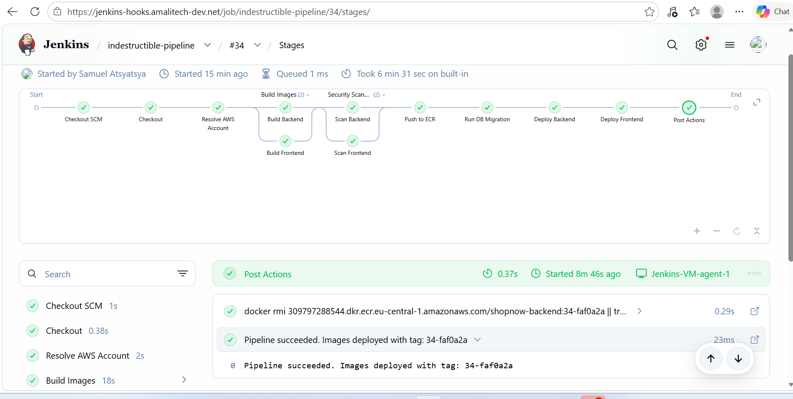
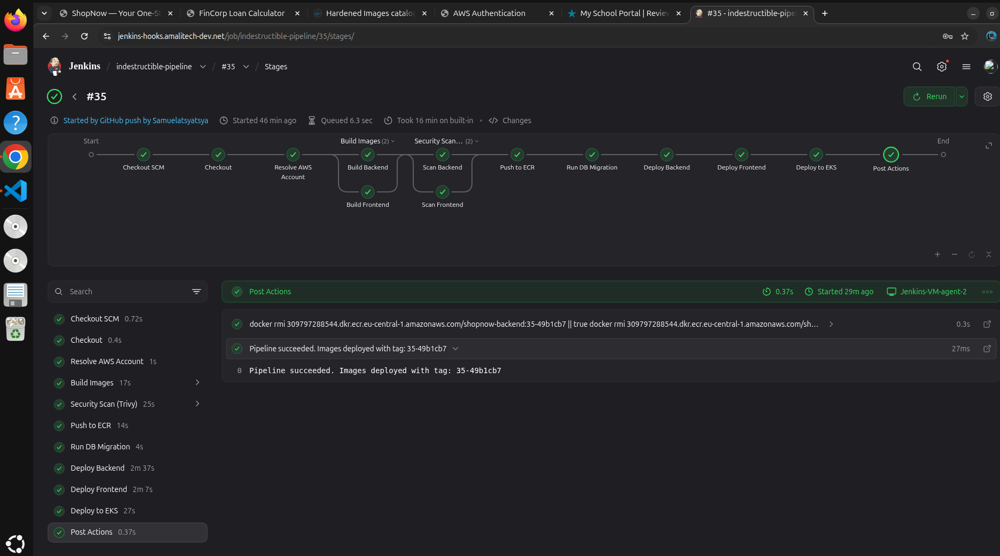
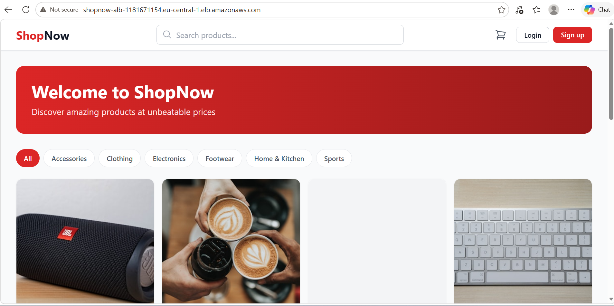
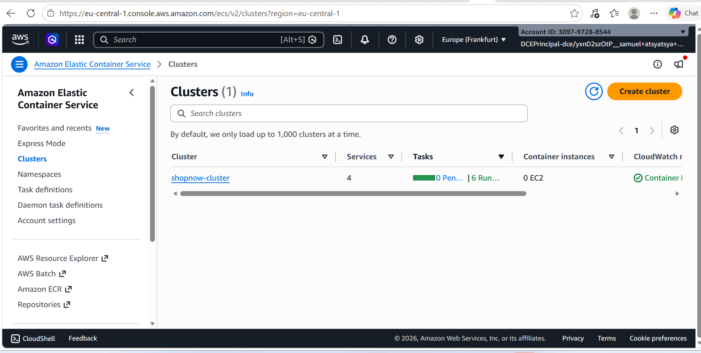
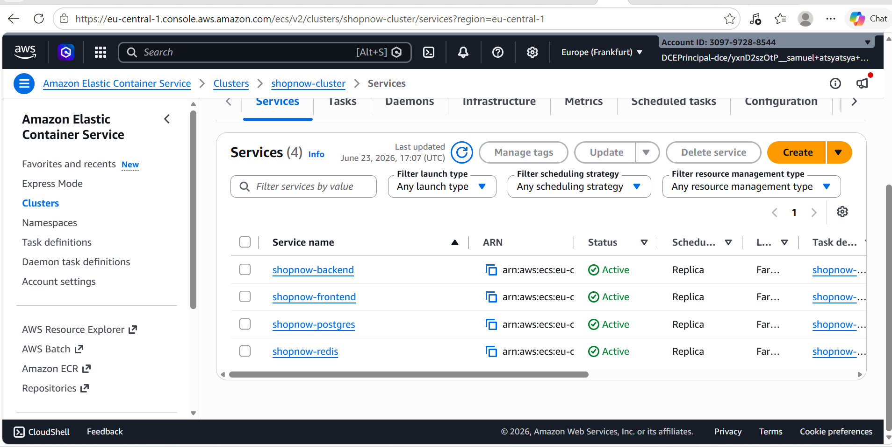
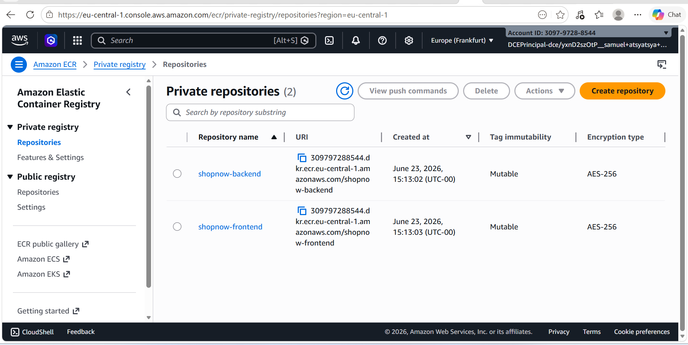
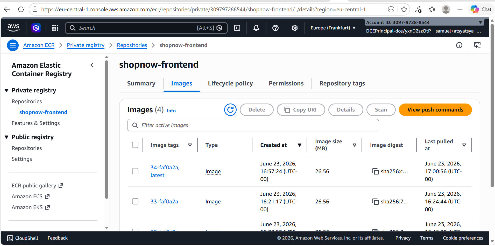
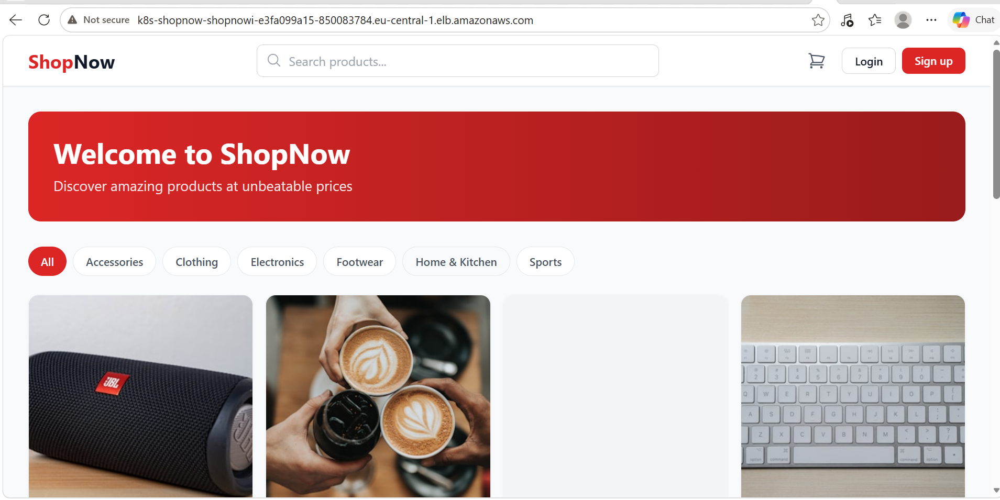
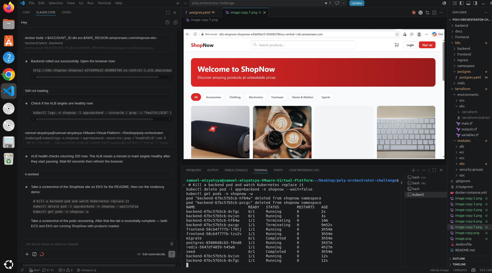

# ShopNow — Poly-Orchestrator Challenge

A 3-tier e-commerce application containerised with Docker and deployed to both **Amazon ECS (Fargate)** and **Amazon EKS** to benchmark orchestration platforms. A Jenkins CI/CD pipeline builds, scans, and deploys on every push.

| Tier | Technology |
|------|------------|
| Frontend | React 18 + Tailwind CSS, served by Nginx |
| Backend API | Node.js + Express, JWT auth |
| Cache | Redis 7 (cart & sessions) |
| Database | PostgreSQL 16 (products, orders, users) |

---

## Architecture

```
Internet
    │
    ▼
  ALB  (single entry point — path-based routing)
  ├─ /*      → Frontend (Nginx serving React SPA)
  └─ /api/*  → Backend (Node.js REST API)
                    │
              ┌─────┴─────┐
           Postgres     Redis
```

Traffic flows through one ALB, eliminating CORS issues and reducing cost vs. two separate load balancers. In ECS, Postgres and Redis run as Fargate services registered with AWS Cloud Map (`postgres.shopnow.local`, `redis.shopnow.local`). In EKS they run as ClusterIP services resolved by Kubernetes DNS.

---

## Repository Structure

```
poly-orchestrator-challenge/
├── frontend/               # React + Tailwind (Vite)
│   ├── src/
│   ├── Dockerfile          # Multi-stage: build → nginx:1.27-alpine
│   └── nginx.conf
├── backend/                # Node.js + Express API
│   ├── src/
│   │   ├── config/         # DB, Redis, migrate, seed
│   │   ├── controllers/    # auth, products, cart, orders
│   │   ├── middleware/     # JWT auth, validate, errorHandler
│   │   └── routes/
│   └── Dockerfile          # node:20-alpine, non-root user
├── docker-compose.yml      # Local development
├── Jenkinsfile             # CI/CD pipeline
├── .trivyignore            # npm-bundled CVEs not reachable at runtime
├── terraform/
│   ├── modules/
│   │   ├── vpc/            # VPC, subnets, NAT gateways
│   │   ├── ecr/            # Container registries
│   │   ├── security-groups/
│   │   ├── ecs/            # Cluster, task defs, services, ALB, Cloud Map
│   │   └── eks/            # Cluster, node group, OIDC, ALB controller IAM
│   └── environments/
│       ├── ecs/            # ECS deployment root (eu-central-1)
│       └── eks/            # EKS deployment root (eu-central-1)
├── k8s/
│   ├── namespace/
│   ├── postgres/
│   ├── redis/
│   ├── backend/
│   ├── frontend/
│   └── ingress/            # AWS Load Balancer Controller ingress
└── docs/
    └── screenshots/
```

---

## Prerequisites

| Tool | Version |
|------|---------|
| Docker | 24+ |
| AWS CLI | v2 |
| Terraform | 1.6+ |
| kubectl | 1.29+ |
| Helm | 3.x |
| Jenkins | 2.x (with AWS credentials plugin) |

### AWS Profile

```bash
aws configure --profile CostDetective
# Region: eu-central-1

aws sts get-caller-identity --profile CostDetective
```

---

## Step 1 — Run Locally with Docker Compose

```bash
docker compose up --build -d
docker compose run --rm migrate
docker compose run --rm seed

open http://localhost
curl http://localhost:3000/api/health
```

---

## Step 2 — Terraform State Bucket

```bash
aws s3 mb s3://shopnow-terraform-state-eu --region eu-central-1 --profile CostDetective
aws s3api put-bucket-versioning \
  --bucket shopnow-terraform-state-eu \
  --versioning-configuration Status=Enabled \
  --profile CostDetective
```

---

## Step 3 — CI/CD with Jenkins

The `Jenkinsfile` runs these stages automatically on every push:

1. **Checkout** — clone repo
2. **Resolve AWS Account** — derives account ID at runtime via `aws sts get-caller-identity` (never hardcoded)
3. **Build Images** — frontend and backend in parallel
4. **Security Scan (Trivy)** — blocks on any HIGH/CRITICAL CVE; both images scanned in parallel
5. **Push to ECR** — tagged with `<build>-<git-sha>`
6. **Run DB Migration** — one-off ECS task before new containers go live
7. **Deploy Backend** — `ecs update-service`, waits for stable
8. **Deploy Frontend** — same, after backend is stable



**Full pipeline including ECS and EKS deploy (build #35):**



### Jenkins setup

Add an AWS credential in Jenkins with ID `indestructible-creds`, then point a pipeline job at this repo.

---

## Step 4 — Deploy to ECS (Fargate)

```bash
cd terraform/environments/ecs

# Create terraform.tfvars (gitignored — contains secrets)
cat > terraform.tfvars <<EOF
aws_region = "eu-central-1"
name       = "shopnow"

frontend_desired_count = 2
backend_desired_count  = 2

db_name     = "shopnow"
db_user     = "shopnow"
db_password = "YOUR_PASSWORD"
jwt_secret  = "YOUR_JWT_SECRET"
EOF

terraform init \
  -backend-config="bucket=shopnow-terraform-state-eu" \
  -backend-config="region=eu-central-1" \
  -backend-config="profile=CostDetective"

terraform apply -var-file=terraform.tfvars
```

This provisions:
- VPC with public/private subnets and NAT Gateway
- ECR repositories for frontend and backend
- ECS cluster with Fargate services: frontend, backend, postgres, redis
- AWS Cloud Map namespace `shopnow.local` for service discovery
- ALB with path-based routing (`/api/*` → backend, `/*` → frontend)

After apply, trigger a Jenkins build to push images and run the migration. Then seed the database:

```bash
SUBNETS=$(aws ec2 describe-subnets \
  --filters 'Name=tag:Name,Values=shopnow-ecs-private-*' \
  --query 'Subnets[*].SubnetId' \
  --output text --region eu-central-1 --profile CostDetective | tr '\t' ',')

BACKEND_SG=$(aws ec2 describe-security-groups \
  --filters 'Name=tag:Name,Values=shopnow-ecs-backend-sg' \
  --query 'SecurityGroups[0].GroupId' \
  --output text --region eu-central-1 --profile CostDetective)

aws ecs run-task \
  --cluster shopnow-cluster \
  --task-definition shopnow-backend:1 \
  --launch-type FARGATE \
  --overrides '{"containerOverrides":[{"name":"backend","command":["node","src/config/seed.js"]}]}' \
  --network-configuration "awsvpcConfiguration={subnets=[$SUBNETS],securityGroups=[$BACKEND_SG],assignPublicIp=DISABLED}" \
  --region eu-central-1 --profile CostDetective
```

### ECS Screenshots

**ShopNow running on ECS — products loaded:**



**ECS cluster — 4 services, 6 running tasks:**



**All 4 ECS services active (frontend, backend, postgres, redis):**



**ECR repositories:**



**ECR images tagged with build number + git SHA:**



### ECS Resiliency Test

```bash
# Stop a backend task
aws ecs stop-task \
  --cluster shopnow-cluster \
  --task $(aws ecs list-tasks --cluster shopnow-cluster \
    --service-name shopnow-backend --query 'taskArns[0]' --output text \
    --region eu-central-1 --profile CostDetective) \
  --region eu-central-1 --profile CostDetective

# ECS replaces it automatically within ~30s
aws ecs describe-services \
  --cluster shopnow-cluster \
  --services shopnow-backend \
  --query 'services[0].{Running:runningCount,Desired:desiredCount}' \
  --region eu-central-1 --profile CostDetective
```

---

## Step 5 — Deploy to EKS

### 5.1 Provision the Cluster

```bash
cd terraform/environments/eks

terraform init \
  -backend-config="bucket=shopnow-terraform-state-eu" \
  -backend-config="region=eu-central-1" \
  -backend-config="profile=CostDetective"

terraform apply
```

Takes ~15 minutes for the EKS control plane.

### 5.2 Configure kubectl

```bash
aws eks update-kubeconfig \
  --name shopnow \
  --region eu-central-1 \
  --profile CostDetective

kubectl get nodes
```

### 5.3 Install AWS Load Balancer Controller

```bash
ALB_ROLE_ARN=$(terraform output -raw alb_controller_role_arn)

helm repo add eks https://aws.github.io/eks-charts
helm repo update

helm install aws-load-balancer-controller eks/aws-load-balancer-controller \
  -n kube-system \
  --set clusterName=shopnow \
  --set serviceAccount.create=true \
  --set serviceAccount.name=aws-load-balancer-controller \
  --set "serviceAccount.annotations.eks\.amazonaws\.com/role-arn=$ALB_ROLE_ARN"

kubectl get deployment aws-load-balancer-controller -n kube-system
```

### 5.4 Deploy the Application

```bash
# Get ECR image URLs
FRONTEND_IMAGE=$(terraform output -raw frontend_ecr_url):latest
BACKEND_IMAGE=$(terraform output -raw backend_ecr_url):latest

# Encode secrets
DB_PASSWORD_B64=$(echo -n 'YOUR_PASSWORD' | base64)
JWT_SECRET_B64=$(echo -n 'YOUR_JWT_SECRET' | base64)

# Namespace
kubectl apply -f k8s/namespace/

# Secrets
sed -e "s|CHANGEME_BASE64|placeholder|g" k8s/backend/secrets.yaml | \
  kubectl apply -f -

kubectl patch secret shopnow-secrets -n shopnow \
  -p "{\"data\":{\"DB_PASSWORD\":\"$DB_PASSWORD_B64\",\"JWT_SECRET\":\"$JWT_SECRET_B64\"}}"

# Data tier
kubectl apply -f k8s/postgres/
kubectl apply -f k8s/redis/

kubectl wait --for=condition=ready pod -l app=postgres -n shopnow --timeout=120s
kubectl wait --for=condition=ready pod -l app=redis -n shopnow --timeout=60s

# Migrate and seed
kubectl run migrate --image=$BACKEND_IMAGE --restart=Never -n shopnow \
  --env="DB_HOST=postgres" --env="DB_PORT=5432" \
  --env="DB_NAME=shopnow" --env="DB_USER=shopnow" \
  --env="DB_PASSWORD=YOUR_PASSWORD" \
  -- node src/config/migrate.js

kubectl wait --for=condition=complete job/migrate -n shopnow --timeout=60s 2>/dev/null || \
  kubectl wait --for=jsonpath='{.status.phase}'=Succeeded pod/migrate -n shopnow --timeout=60s

kubectl run seed --image=$BACKEND_IMAGE --restart=Never -n shopnow \
  --env="DB_HOST=postgres" --env="DB_PORT=5432" \
  --env="DB_NAME=shopnow" --env="DB_USER=shopnow" \
  --env="DB_PASSWORD=YOUR_PASSWORD" \
  -- node src/config/seed.js

# App tier
sed "s|BACKEND_ECR_IMAGE|$BACKEND_IMAGE|g" k8s/backend/backend.yaml | kubectl apply -f -
sed "s|FRONTEND_ECR_IMAGE|$FRONTEND_IMAGE|g" k8s/frontend/frontend.yaml | kubectl apply -f -

# Ingress (ALB)
kubectl apply -f k8s/ingress/

# Get the ALB URL (~2 min to provision)
kubectl get ingress -n shopnow
```

### EKS Screenshots

**ShopNow running on EKS — products loaded:**



**All pods running + resiliency demo (backend pods replaced after deletion):**



### EKS Resiliency Test

```bash
# Kill a backend pod
kubectl delete pod -l app=backend -n shopnow --wait=false

# Watch Kubernetes immediately schedule replacements
kubectl get pods -n shopnow -w
```

---

## API Reference

| Method | Endpoint | Auth | Description |
|--------|----------|------|-------------|
| GET | `/api/health` | — | Health check |
| POST | `/api/auth/register` | — | Register user |
| POST | `/api/auth/login` | — | Login, returns JWT |
| GET | `/api/auth/me` | JWT | Current user |
| GET | `/api/products` | — | List products |
| GET | `/api/products/:id` | — | Single product |
| GET | `/api/products/categories` | — | Categories |
| GET | `/api/cart` | JWT | Get cart |
| POST | `/api/cart/add` | JWT | Add item |
| PUT | `/api/cart/update` | JWT | Update quantity |
| DELETE | `/api/cart/item/:id` | JWT | Remove item |
| DELETE | `/api/cart/clear` | JWT | Clear cart |
| POST | `/api/orders/checkout` | JWT | Place order |
| GET | `/api/orders` | JWT | My orders |
| GET | `/api/orders/:id` | JWT | Order detail |

---

## ECS vs EKS — Benchmark

| | ECS (Fargate) | EKS (Node Groups) |
|---|---|---|
| Provisioning time | ~5 min | ~15 min |
| Operational overhead | Low — AWS manages everything | High — node management, add-ons |
| Cost model | Pay per task (vCPU + RAM) | Pay per node (always-on EC2) |
| Scaling | Per-service autoscaling | HPA + Cluster Autoscaler |
| Self-healing | ECS replaces failed tasks | K8s replaces failed pods |
| Service discovery | AWS Cloud Map | Kubernetes DNS (kube-dns) |
| Ingress | ALB via Terraform | ALB via AWS Load Balancer Controller |
| Ecosystem | AWS-native | CNCF / portable |
| Best for | Simple workloads, AWS-only shops | Complex workloads, multi-cloud, GitOps |

---

## Teardown

```bash
# EKS
kubectl delete namespace shopnow
cd terraform/environments/eks && terraform destroy

# ECS
cd terraform/environments/ecs && terraform destroy
```
